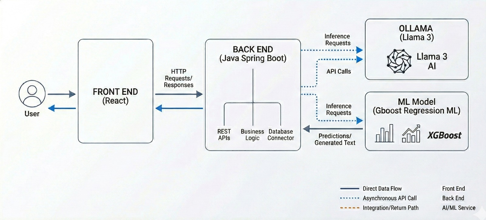

<p align="center">
  <a href="https://www.demonhacks.com/"></a>
  &nbsp;&nbsp;&nbsp;
  <a href="https://www.demonhacks.com/"></a>
  &nbsp;&nbsp;&nbsp;
  <a href="https://www.demonhacks.com/"></a>
    &nbsp;&nbsp;&nbsp;
  <a href="https://www.demonhacks.com/"></a>
</p>

<p align="center">
  <strong>Built at <a href="https://www.demonhacks.com/">DemonHacks 2026</a> — DePaul University's UPE & CSS Hackathon</strong>
</p>

---


# LoopShare — Revitalizing Chicago's Loop, One Desk at a Time

**An AI-powered desk-sharing marketplace that turns empty corporate offices into startup launchpads.**

---

## The Problem

Chicago's Loop is the economic heart of the city — but since the shift to remote work, office occupancy has plummeted. The ripple effect is devastating: cafeterias, restaurants, and small shops that depend on foot traffic are closing one by one. Entire blocks are going dark.

**LoopShare** is our answer. We connect corporations sitting on empty floors with startups hungry for affordable, flexible desk space in a premier downtown location. More desks filled means more workers in the Loop, more lunch orders, more coffee runs, more life on the streets — revitalizing the small businesses that make the neighborhood thrive.

---

## How It Works

LoopShare serves **two types of users**:

### Hosts (Corporations)
Companies with underutilized office space in the Loop. They can:
- **Post a Listing** — List available desks with pricing, days, floor, and amenities
- **Tax Estimator** — Calculate Illinois Enterprise Zone Act tax savings from desk-sharing revenue
- **Host Dashboard** — Manage listings, view incoming bookings, and track occupancy

### Startups (Tenants)
Small teams looking for flexible, affordable desk space. They can:
- **Find a Host** — Browse all active listings with filters, maps, and building details
- **AI Match** — Fill out a profile (sector, team size, budget, preferred zone, days needed) and let our AI pipeline find the top 3 best-fit offices in seconds
- **Find New Host** — Our ML model proactively identifies "ghost buildings" with declining occupancy — buildings ripe for desk-sharing before they even list on the platform
- **Startup Dashboard** — View bookings and saved listings

---

## Architecture



The platform is built from **four modules**:

### 1. Frontend — React + Vite
A single-page app with interactive Leaflet maps, Chart.js visualizations, and a clean onboarding flow. The Vite dev server proxies API calls to both the backend and the ML service.

**Tech:** React 19, React Router 7, Leaflet, Chart.js, plain CSS

### 2. Backend — Spring Boot (Java)
The REST API layer handling users, listings, bookings, buildings, and the AI orchestration pipeline. Uses an H2 in-memory database seeded with 21 real Loop buildings, 8 hosts, 10 listings, and 10 startups.

**Tech:** Java 11, Spring Boot 2.7, Spring Data JPA, H2, Swagger UI

### 3. ML Occupancy Model — Python + scikit-learn
A **Gradient Boosting Regressor** trained by us on real **Chicago Energy Benchmarking data**. The model uses building energy usage (EUI, electricity, natural gas) and physical attributes (floors, year built, square footage) to **predict occupancy rates**. Buildings where predicted occupancy has dropped significantly since 2019 are flagged as "ghost buildings" — prime candidates for desk-sharing outreach.

**Tech:** Python, scikit-learn, Flask, pandas — trained on 10+ years of public Chicago energy data

### 4. Agentic AI — Ollama (llama3.2, local)
A multi-agent system powered by a **locally-running Ollama LLM** — no paid API keys, no cloud dependency. The four agents work together in a single orchestrated pipeline:

| Agent | What it does |
|-------|-------------|
| **MatcherAgent** | Scores listings against startup needs using a deterministic formula + real energy data, then asks the LLM to explain each match in natural language |
| **AnalystAgent** | Tool-use agent that autonomously calls Chicago public APIs (energy, violations, CTA ridership) to produce a deep building intelligence report |
| **RiskAgent** | Scores deal risk (0–100) for both host and tenant by checking business licenses and building violations via the LLM |
| **OutreachAgent** | Generates a personalized outreach email and a one-page lease draft using all data gathered by the other agents |

The LLM is also used in **Deal Scout** to enrich company profiles for each building and draft outreach messaging — all running locally on `llama3.2` with zero API costs.

---

## Quick Start

```bash
# 1. Backend
cd demo
./mvnw spring-boot:run          # Windows: mvnw.cmd spring-boot:run
# Runs on http://localhost:8003

# 2. ML Model (new terminal)
cd occupancy_model
pip install -r requirements.txt
python api.py
# Runs on http://localhost:5000

# 3. Frontend (new terminal)
cd frontend
npm install && npm run dev
# Runs on http://localhost:3000

# 4. Make sure Ollama is running with:
ollama pull llama3.2
ollama serve
```

| Prerequisite | Version |
|-------------|---------|
| Java | 11+ |
| Node.js | 18+ |
| Python | 3.9+ |
| Ollama | latest ([ollama.com](https://ollama.com)) |

No Docker, external database, or cloud API keys required. Everything runs locally.

---

## Data Sources — 100% Public Data


<table><tr><td>

Every data point in LoopShare comes from the **[Chicago Open Data Portal](https://data.cityofchicago.org/)** — free, open, and maintained by the City of Chicago. No proprietary datasets, no scraping, no API keys.

</td><td>

<a href="https://data.cityofchicago.org/"></a>

</td></tr></table>


| Dataset | What we use it for |
|---------|-------------------|
| [Energy Benchmarking](https://data.cityofchicago.org/Environment-Sustainable-Development/Chicago-Energy-Benchmarking/xq83-jr8c) | EUI scores, ML model training, building efficiency |
| [Building Violations](https://data.cityofchicago.org/Buildings/Building-Violations/22u3-xenr) | Risk scoring (fire, structural, electrical) |
| [CTA Ridership](https://data.cityofchicago.org/Transportation/CTA-Ridership-Daily-Boarding-Totals/6iiy-9s97) | Occupancy proxy for the Loop district |
| [Business Licenses](https://data.cityofchicago.org/Community-Economic-Development/Business-Licenses/uupf-x98q) | Company verification and risk assessment |

### Why this matters beyond the hackathon

Because LoopShare is built entirely on public data, it can serve as a **tool for City Hall and the State of Illinois** — not just startups and corporations. The city already collects this data; we turn it into actionable intelligence:

- **Chicago City Hall** could use our ghost-building detector to identify underutilized properties for economic development programs, zoning incentives, or targeted outreach.
- **The State of Illinois** could track Enterprise Zone Act utilization and measure desk-sharing's impact on downtown economic recovery.
- **Small business coalitions** could use Loop occupancy trends to advocate for foot-traffic revitalization programs.

Open data in, public good out. That's the idea.

---

## Team

- Diego Fernandez Arias
- Laura Rueda Garcia
- Pablo Bote Lopez
- Hernan Garcia Quijano


Built at [**DemonHacks 2026**](https://www.demonhacks.com/) by the LoopShare team. Revitalizing Chicago's Loop — one desk at a time.

<p align="center">
  <a href="https://www.demonhacks.com/"></a>
</p>
